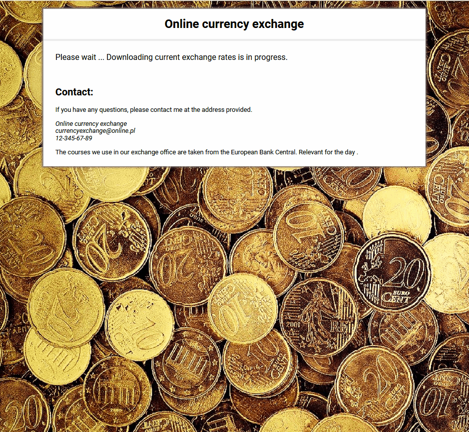

# Simple currency converter

My currency converter allows you to calculate how much you would get if you exchanged one currency for another based on an exchange rate taken from the ECB. I created this converter during the course by YOUCODE.

## Where can I find this converter?

Below I attached link to this website:

[Currency-office](https://anetaszynal.github.io/currency-office-react/)

## Now, see how to use

## Description

There you will find a place to replenish the amount you want to exchange. Additionally, you can choose one of the currencies published by the ECB (one you have and one you want to have)

After pressing the button check the rate, the current rate will appear. After pressing the button, make the transaction, you will exchange your funds.

**Technologies, libraries and methodologies used:**

- HTML
- CSS
- JavaScript
- React.js

## How to use?

1. Choose a currency type you wish to convert.
2. Select the type of currency you want to receive.
3. Check the current course by pressing the button
4. If you want to continue making the transaction, enter the amount and press the "make transaction" button
